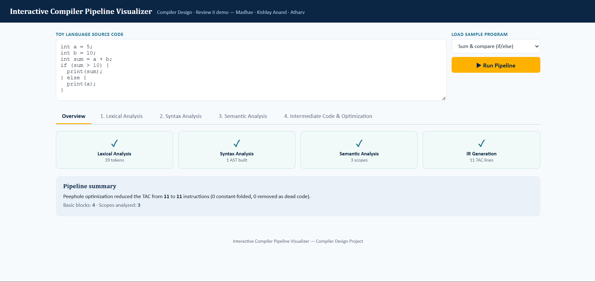
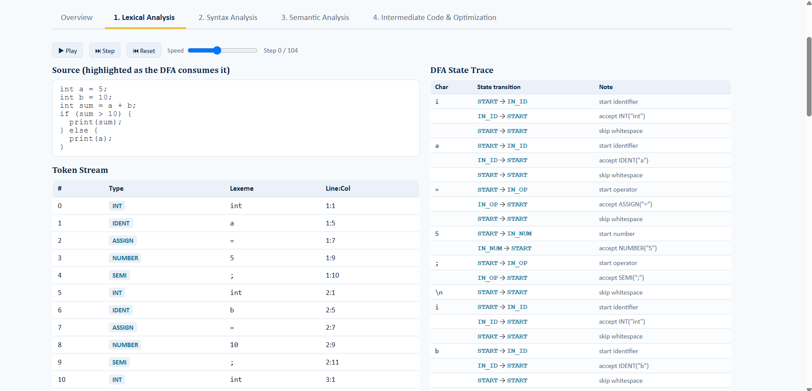
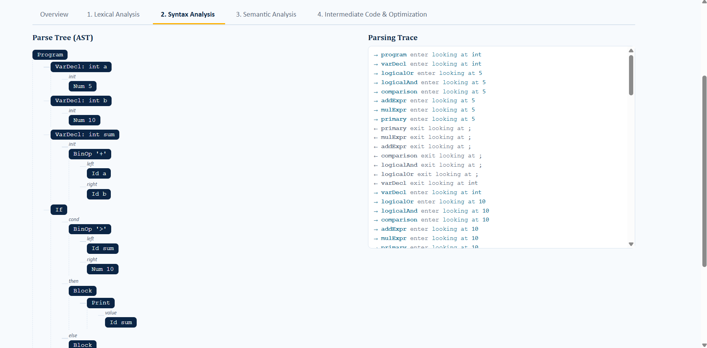
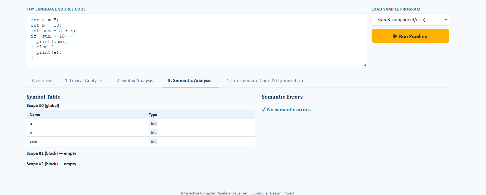
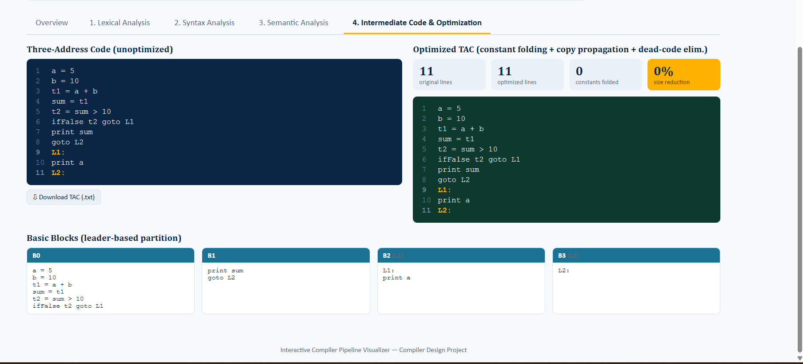

# Interactive Compiler Pipeline Visualizer (ICPV)

A browser-based tool that shows each phase of a compiler working on a program written in a small toy language. Write or load a program, click **Run Pipeline**, and inspect the output of every stage: lexical analysis, syntax analysis, semantic analysis, intermediate code generation, and optimization.

**Course:** Compiler Design, Review II
**Team:** Madhav, Kishlay Anand, Atharv<br>
**Live demo:** https://madhav1303.github.io/interactive-compiler-pipeline-visualizer/<br>



---

## Features

- **Lexical analysis:** converts source code into a token stream
- **Syntax analysis:** builds and displays the parse tree
- **Semantic analysis:** symbol table, type checking, and error reporting (e.g. undeclared variables)
- **Intermediate code generation:** produces three-address code
- **Optimization:** improves the intermediate code (e.g. constant folding)
- **Overview tab:** summary of the whole pipeline
- **8 built-in sample programs**, including two that deliberately contain errors
- Runs fully in the browser: no installation, no server, no build step

---

## How to Run

**Online:** open the live demo link above.

**On your computer:**
1. Clone the repository, or download it as a ZIP and extract it.
2. Double-click `index.html`. It opens in your default browser (Chrome, Edge, or Firefox).

```bash
git clone https://github.com/YOUR-USERNAME/YOUR-REPO-NAME.git
cd YOUR-REPO-NAME
```

Keep the folder structure intact, because `index.html` loads `style.css` and the files in `js/`.

## How to Use

1. Type a program in the **source code** box, or pick one from **Load sample program**.
2. Click **Run Pipeline**.
3. Switch between the tabs to see each phase:
   Overview, 1. Lexical Analysis, 2. Syntax Analysis, 3. Semantic Analysis, 4. Intermediate Code & Optimization.

---

## Sample Programs

| # | Sample | What it demonstrates |
|---|--------|----------------------|
| 1 | Sum & compare (if/else) | Conditionals |
| 2 | While loop countdown | While loops |
| 3 | For loop | For loops |
| 4 | Logical operators (&& / \|\|) | Logical expressions |
| 5 | Constant folding demo | Optimization |
| 6 | int/float mixing | Type handling |
| 7 | Semantic error: undeclared var | Semantic error detection |
| 8 | Syntax error: missing ';' | Syntax error detection |

---

## Supported Language

A small C-like toy language.

```
program    := statement* EOF
statement  := varDecl | assignStmt | ifStmt | whileStmt | forStmt
            | printStmt | block
varDecl    := ("int" | "float") IDENT ("=" expr)? ";"
assignStmt := IDENT "=" expr ";"
ifStmt     := "if" "(" expr ")" block ("else" block)?
whileStmt  := "while" "(" expr ")" block
forStmt    := "for" "(" (varDecl | IDENT "=" expr ";") expr ";"
              IDENT "=" expr ")" block
printStmt  := "print" "(" expr ")" ";"
block      := "{" statement* "}"
expr       := logicalOr
logicalOr  := logicalAnd ("||" logicalAnd)*
logicalAnd := comparison ("&&" comparison)*
comparison := addExpr (("<" | ">" | "==" | "!=" | "<=" | ">=") addExpr)?
addExpr    := mulExpr (("+" | "-") mulExpr)*
mulExpr    := unary (("*" | "/") unary)*
unary      := "-" unary | primary
primary    := NUMBER | IDENT | "(" expr ")"
```

**Data types:** `int`, `float`
**Statements:** variable declaration (with optional initializer), assignment, `if` / `else`, `while`, `for`, `print`, `{ }` blocks
**Operators (low to high precedence):** `||`, `&&`, relational (`<` `>` `==` `!=` `<=` `>=`), `+` `-`, `*` `/`, unary `-`
**Parser type:** recursive descent, with a parsing trace shown in the UI

---

## Project Structure

```
.
├── index.html          # Main page
├── style.css           # Styles
├── js/
│   ├── lexer.js        # Lexical analysis
│   ├── parser.js       # Syntax analysis
│   ├── semantic.js     # Semantic analysis
│   ├── ir.js           # Intermediate code generation
│   ├── optimizer.js    # Optimization
│   ├── visualizer.js   # Renders each phase in the UI
│   └── app.js          # Wires the UI to the pipeline
└── README.md
```

---

## Example
**Input**
```
int a = 5;
int b = 10;
int sum = a + b;
if (sum > 10) {
  print(sum);
} else {
  print(a);
}
```

**Three-address code**
```
a = 5
b = 10
t1 = a + b
sum = t1
t2 = sum > 10
ifFalse t2 goto L1
print sum
goto L2
L1:
print a
L2:
```

| Phase | Screenshot |
|-------|------------|
| Lexical Analysis |  |
| Syntax Analysis |  |
| Semantic Analysis |  |
| IR & Optimization |  |

---

## Test Cases

| # | Sample | Expected Output | Actual Output | Status |
|---|--------|-----------------|---------------|--------|
| 1 | Sum & compare | 39 tokens, AST built, 3 scopes, no errors; 11 TAC lines, 4 basic blocks | 39 tokens, AST built, 3 scopes, no errors; 11 TAC lines (unoptimized and optimized), 4 basic blocks (B0 to B3) | Pass |
| 2 | While loop countdown | Loop translated to labels (L1, L2) with conditional and unconditional jumps | 25 tokens, 2 scopes, no errors; 9 TAC lines (unchanged by optimizer), 4 basic blocks (B0 to B3) | Pass |
| 3 | For loop | Init runs once before the loop label; condition, body and update translated with labels (L1, L2) and jumps | 36 tokens, 1 AST built, 3 scopes, no errors; 12 TAC lines (unchanged by optimizer, 0 constants folded, 0% reduction), 4 basic blocks (B0 to B3) | Pass |
| 4 | Logical operators | `&&` condition evaluated into a temporary, then used in a conditional jump with labels (L1, L2) | 38 tokens, 1 AST built, 3 scopes, no errors; 12 TAC lines (unchanged by optimizer, 0 constants folded, 0% reduction), 4 basic blocks (B0 to B3) | Pass |
| 5 | Constant folding | `x = 14` and `print x` (2 TAC lines after optimization) | 15 tokens, no errors; TAC reduced from 4 to 2 lines (2 constants folded, 50% reduction); optimized output `x = 14`, `print x` | Pass |
| 6 | int/float mixing | No type error when int values are assigned to a float variable; symbol table shows avg as float, total and count as int | 27 tokens, 1 AST built, 1 scope, no semantic errors; symbol table: avg (float), total (int), count (int); 6 TAC lines (unchanged by optimizer, 0 constants folded, 0% reduction), 1 basic block (B0) | Pass |
| 7 | Undeclared variable | Semantic error reported for `y` | 2 semantic errors: "Line 2: Undeclared variable 'y'" and "Line 3: Undeclared variable 'y'"; symbol table contains only `x` (int) | Pass |
| 8 | Missing ';' | Syntax error reported | 1 syntax error: "Line 2: Expected ';' but found 'print'"; no parse tree is built | Pass |

---

## Team Contributions

| Name | Modules |
|------|---------|
| Madhav | |
| Kishlay Anand | |
| Atharv | |

---

## Tech Stack

HTML, CSS, JavaScript. No frameworks or dependencies.

## Limitations

- Only `int` and `float` types (no strings, chars, or booleans)
- No functions, arrays, or pointers
- No `!` (logical not) or `%` (modulo) operators
- `else` must be followed by a `{ }` block, so `else if` needs a nested block
- Relational operators cannot be chained (`a < b < c` is not allowed)
- The parser stops at the first syntax error

## Future Work
- Short-circuit evaluation for `&&` and `||` (currently both sides are always evaluated)
- Explicit int-to-float conversion in the three-address code
- Constant propagation through variables (e.g. folding `total / count` when both values are known)
- Merging `t2 = sum + i; sum = t2` into `sum = sum + i`
- Target code generation
